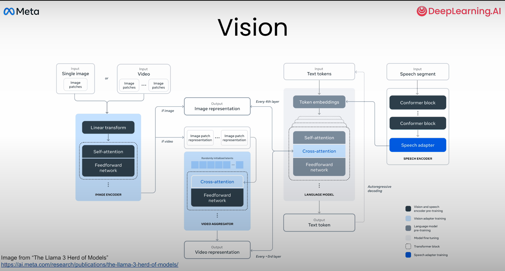

Thanks Andrew Ng for providing DeepLearning.AI short course's and very well explained and curated by Amit Sangani. It says it takes 1 hour to finish but trust me its more than that and much more to valuable to explore the hashtag#Llama3.2 vision model and its capabilities.

Here are my Key take aways:
*** Key feature: New Role has added "ipython" - to build own functions in agentic API's.

### architecure: Llama3.2 vision built on two components:

  

1. pre-trained Image encoder
2. pre-trained text encoder 
How it works: 
a) by combining them using cross-attention layers between two models.
b) Image and text are provided to respective models: Image information is conveyed to language model and language model produces text response (as shown in below screenshots)

### Usecase can be build some of them are:
1. OCR (text and calculation response)
2. architecture to code (convert architecture dig to python code)
3. fridge (capture refrigerator image, and ask what is inside? and follow up question: Which dishes can be made?)
4. Interior Designer Assistant
5. ** Tool calling with Image **

### Prompt: 4 roles:
1. System: Sets context in which to interact with AI. Typically includes rules and guidelines. (Suppose you are French assistant and answer in only french)
2. User: Human Interaction (Questions, msgs)
3. ipython: to use custom tool functions
4. Assistant: Response generated by model: based on the context provided by system, user and ipython. (Basically to follow up question)

# Tokenizer: hashtag#Llama 3 family uses 128,000 tokens:
100,000 (tiktoken3 tokenizer)
28,000 (to support non English language)

### Agentic Applications: requires tool calling (function calling):
- access real time information (ex API: hashtag#Tavily)
- perform complex math or tasks (ex API: hashtag#wolfrom_alpha)
- interacting with external data & systems
- building dynamic agents

### Llama Stack API's - to support whole model lifecycle:
1. Agentic System API's (memory, orchestrators)
2. Tool Chain API's: (batch inferences, Real Time inferences, continuous pretraining, evals, reward scoring etc.)

### FutureScope: Speech can be added by enabling hashtag#speechtotext encoder.

Use the below URL to access the short course on hashtag#Multimodal Llama 3.2 vison: 
https://lnkd.in/d7rPKGb2

### Course Complettion:
https://learn.deeplearning.ai/accomplishments/ac218007-9368-4bc9-a9cb-6c61f10d610a?usp=sharing
